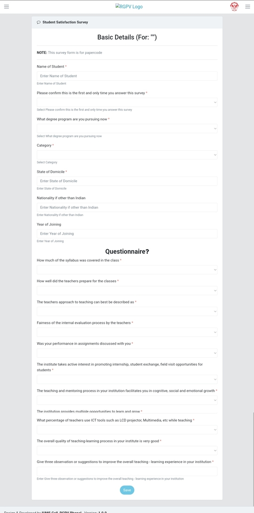

# Exam Form Autofill

degree.rgpvexam.in basic details autofill by python selenium


### Introduction

It will open the webpage [degree.rgpvexam.in](https://degree.rgpvexam.in/#/login) login using my username and password, click the submit button and in the next window fill the questionnaire with my basic details and choose options randomly and click submit.


### Installation

Required selenium library with webdriver

```bash
  pip install selenium
```

### Libraries used

Selenium


### Questions Image



### Demo Video
[Click Here](https://youtu.be/qNwcQCBpBul)
